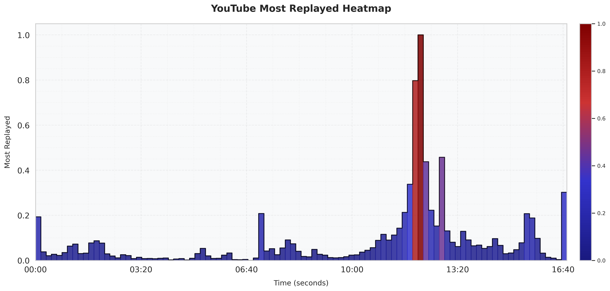

<div align="center">
  <a href="https://www.python.org"></a>
  <h1>📈 YouTube Most Replayed Extractor</h1>
  <p>
    A simple tool to extract and visualize YouTube's "Most Replayed" graph, data made available to all users in May 2022
  </p>
</div>

---

## About

YouTube's *Most Replayed* feature highlights the most-watched segments of a video via a heatmap. This project allows you to extract and analyze that data programmatically via [youtube-dl](https://github.com/ytdl-org/youtube-dl)



---

## Setup

1. Make sure you have [uv](https://github.com/astral-sh/uv) installed (command for macOS):
   ```bash
   curl -LsSf https://astral.sh/uv/install.sh | sh 
   ```

2. Run a video example:
   ```bash
   uv run main.py --video_id dQw4w9WgXcQ
   ```

---

## Usage
Arguments to play with:

| Argument               | Type    | Default | Description                                              |
|------------------------|---------|---------|----------------------------------------------------------|
| `--video_id`           | `str`   | **Required** | YouTube video ID to process                         |
| `--save_heatmap`       | `bool`  | `True`  | Save a heatmap image           |
| `--show_chapters`  | `bool`  | `False` | Overlay chapter lines on the heatmap, if available      |
